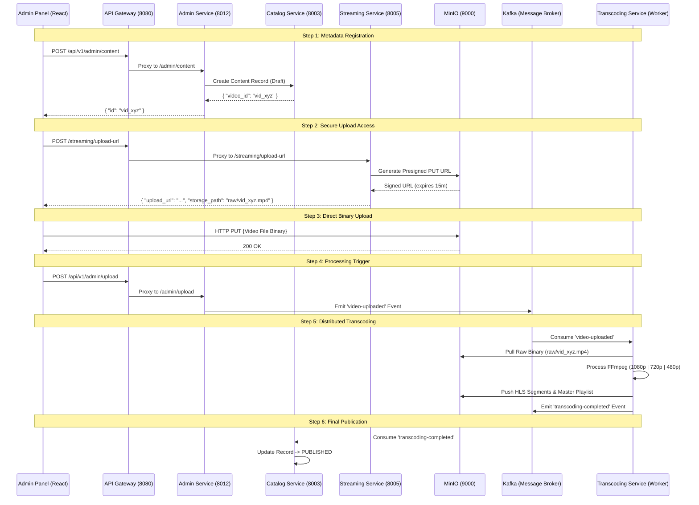

# High-Performance Video Upload & Processing Architecture

This document provides a highly technical, step-by-step breakdown of the end-to-end video lifecycle, from metadata creation to global HLS distribution.

---

## 1. System Architecture (Event-Driven)



---

## 2. Detailed Technical Breakdown

### Step 1: Create Content Metadata

- **Service**: `Admin Service` (via `Catalog Service`)
- **Request**: `POST /api/v1/admin/content`
- **Input Body**:
  ```json
  {
    "title": "Cosmic Voyage",
    "description": "Exploration of deep space.",
    "type": "movie",
    "genres": ["Sci-Fi", "Documentary"]
  }
  ```
- **Result**: A new record is created in MongoDB with status `PENDING`. Returns `video_id`.

### Step 2: Request Secure Upload URL

- **Service**: `Streaming Service`
- **Request**: `POST /streaming/upload-url`
- **Input Body**: `{ "video_id": "vid_xyz" }`
- **Internal Action**: Calls MinIO Go SDK -> `FGetPresignedURL`.
- **Response Body**:
  ```json
  {
    "upload_url": "http://minio:9000/videos/raw/vid_xyz.mp4?X-Amz-Signature=...",
    "storage_path": "raw/vid_xyz.mp4"
  }
  ```

### Step 3: Binary Upload (Browser to MinIO)

- **Mechanism**: `XMLHttpRequest` (PUT)
- **Target**: `upload_url` from Step 2.
- **Benefit**: Zero overhead on backend microservices. Multi-gigabyte files are handled by MinIO's optimized storage engine.

### Step 4: Notify Upload Completion

- **Service**: `Admin Service`
- **Request**: `POST /api/v1/admin/upload`
- **Input Body**:
  ```json
  {
    "video_id": "vid_xyz",
    "title": "Cosmic Voyage",
    "storage_path": "raw/vid_xyz.mp4"
  }
  ```
- **Action**: Service validates the request and sends a Kafka message to topic `video-uploaded`.

### Step 5: Worker Transcoding Pipeline

- **Service**: `Transcoding Service`
- **Input Event**: `topic: video-uploaded`
- **Process**:
  1. Downloads `raw/vid_xyz.mp4`.
  2. Runs FFmpeg: `ffmpeg -i input.mp4 -hls_list_size 0 -hls_time 10 master.m3u8`.
  3. Generates 3 adaptive bitrates.
  4. Uploads result to `hls/vid_xyz/` bucket.
- **Output Event**: `topic: transcoding-completed`
  - **Payload**: `{ "video_id": "vid_xyz", "hls_url": "http://cdn/hls/vid_xyz/master.m3u8" }`.

### Step 6: Publish Content

- **Service**: `Catalog Service`
- **Input Event**: `topic: transcoding-completed`
- **Action**: Updates the content document in MongoDB. Sets `is_published: true` and attaches the final streaming URL.

---

## 3. Final State Summary

| Storage Layer         | Result Path                    | Format          |
| :-------------------- | :----------------------------- | :-------------- |
| **MinIO (Raw)**       | `videos/raw/vid_xyz.mp4`       | Original Binary |
| **MinIO (Streaming)** | `hls/vid_xyz/master.m3u8`      | HLS Playlist    |
| **MongoDB**           | `content.status = "PUBLISHED"` | Metadata        |
