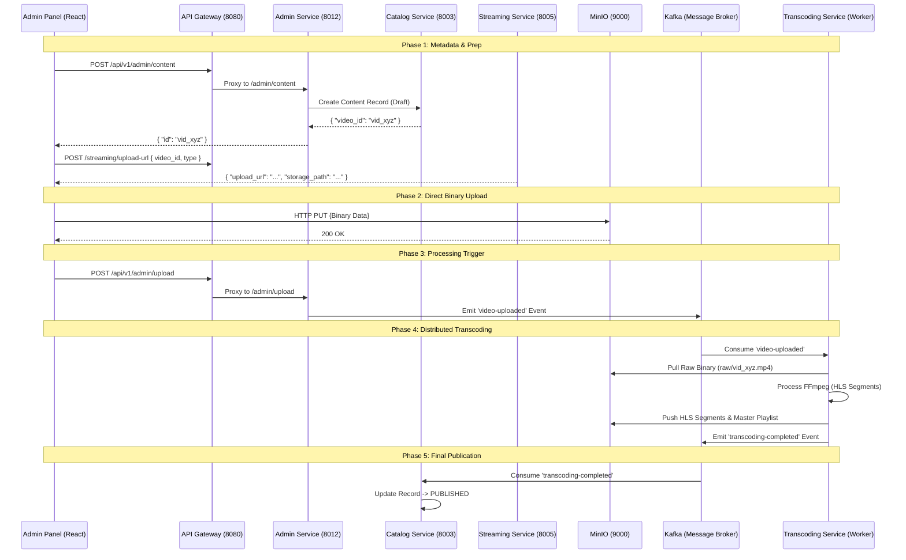

# Video Upload & Processing — How It Works

> **Stack**: Go (Admin, Streaming) · Python/FFmpeg (Transcoding) · MinIO (S3) · Kafka · MongoDB (Catalog)
> **Pattern**: Direct-to-S3 Upload · Event-Driven Architecture · Distributed Transcoding · HLS/DASH Packaging

---

## Table of Contents

1. [Overview](#overview)
2. [System Architecture](#system-architecture)
3. [Key Technical Decisions](#3-key-technical-decisions)
4. [Storage Mapping](#4-storage-mapping)
5. [Process Flow Breakdown](#process-flow-breakdown)
   - [Phase A: Metadata Registration](#phase-a-metadata-registration)
   - [Phase B: Secure Direct Upload](#phase-b-secure-direct-upload)
   - [Phase C: Distributed Transcoding](#phase-c-distributed-transcoding)
   - [Phase D: Completion](#phase-d-completion)

---

## Overview

This architecture handles the end-to-end lifecycle of high-definition video assets—from raw binary upload to adaptive bitrate streaming (HLS/DASH). By decoupling the upload from the processing, the system can scale horizontally to handle thousands of concurrent uploads without sacrificing performance.

**Key design principles:**

- **Zero-Proxy Uploads**: Massive video binaries never touch the application server; they go directly from the browser to MinIO.
- **Asynchronous Processing**: Transcoding is handled by dedicated workers, triggered via Kafka events.
- **Adaptive Bitrate**: Videos are automatically converted into multiple resolutions (1080p, 720p, 480p) for smooth playback on any network.
- **Fail-Safe Retries**: Using Kafka's message persistence, failed transcoding jobs are automatically retried.

---

## System Architecture



---

## Process Flow Breakdown

### Phase A: Metadata Registration

`POST /api/v1/admin/content`

The first step creates a placeholder record. This allows the system to track progress and prevent "orphaned" uploads.

**Request:**

```json
{
  "title": "Cosmic Voyage",
  "description": "Exploration of deep space.",
  "type": "movie",
  "genres": ["Sci-Fi", "Documentary"]
}
```

**Response `201 OK`:**

```json
{
  "error": null,
  "message": "ok",
  "data": {
    "id": "vid_xyz",
    "status": "PENDING"
  }
}
```

---

### Phase B: Secure Direct Upload

To prevent the backend from becoming a bottleneck, we use **Presigned URLs**. The `Streaming Service` generates a temporary, cryptographically signed URL that allows the browser to upload directly to MinIO.

`POST /api/v1/streaming/upload-url`

**Request:**

```json
{
  "video_id": "vid_xyz",
  "type": "source"
}
```

_(Supports: `source`, `trailer`, `poster`, `banner`)_

**Response `200 OK`:**

```json
{
  "error": null,
  "message": "ok",
  "data": {
    "upload_url": "http://minio:9000/videos/raw/vid_xyz.mp4?X-Amz-Signature=...",
    "storage_path": "raw/vid_xyz.mp4"
  }
}
```

---

## Event-Driven Trigger

Once the browser confirms the binary is successfully stored in MinIO, it notifies the `Admin Service`. This service performs a final validation and starts the background pipeline.

`POST /api/v1/admin/upload`

**Kafka Topic:** `video-uploaded`
**Event Payload:**

```json
{
  "video_id": "vid_xyz",
  "title": "Cosmic Voyage",
  "storage_path": "raw/vid_xyz.mp4",
  "timestamp": "2026-03-28T12:00:00Z"
}
```

---

### Phase C: Distributed Transcoding

The **Transcoding Service** is a worker node that listens for new uploads. It is designed to be stateless and can be scaled horizontally.

**Process Execution:**

1. **Fetch**: Pulls the raw `.mp4` from `videos/raw/vid_xyz.mp4`.
2. **Process**: Runs FFmpeg to generate an HLS stream:
   ```bash
   ffmpeg -i input.mp4 -hls_list_size 0 -hls_time 10 master.m3u8
   ```
3. **Multi-Bitrate**: Generates 1080p, 720p, and 480p versions.
4. **Push**: Uploads the entire folder of `.ts` segments and the `.m3u8` playlist to the `hls/` bucket.

---

## Phase D: Completion

Final Publication: The Catalog Service hears the completion event, updates the MongoDB record to **PUBLISHED**, and attaches the final HLS URL. The video is now live for users.

---

## 4. Storage Mapping

| Asset       | Path in MinIO                 | Content Type        |
| :---------- | :---------------------------- | :------------------ |
| **Source**  | `videos/raw/{id}.mp4`         | High-quality master |
| **Trailer** | `videos/raw/{id}_trailer.mp4` | Promo clip          |
| **Images**  | `videos/raw/{id}_poster.jpg`  | Metadata assets     |
| **Stream**  | `hls/{id}/master.m3u8`        | The playable stream |

---

## 3. Key Technical Decisions

| Feature            | Design Choice     | Benefit                                                                                                        |
| :----------------- | :---------------- | :------------------------------------------------------------------------------------------------------------- |
| **Direct Upload**  | Presigned S3 URLs | Eliminates backend proxying; supports 10GB+ files easily.                                                      |
| **Worker Scaling** | Kafka + Workers   | You can spin up 50 FFmpeg workers during peak hours without slowing down the site.                             |
| **Reliability**    | Event Persistence | If a worker crashes mid-transcode, Kafka ensures the message is retried.                                       |
| **UX**             | Status Polling    | The Admin UI polls the Catalog Service to show real-time progress (Metadata → Uploading → Transcoding → Live). |

_This flow ensures that the system is scalable (more workers), reliable (event-driven), and cost-effective (minimized data transfer between services)._

---

_Last updated: 2026-03-28_
