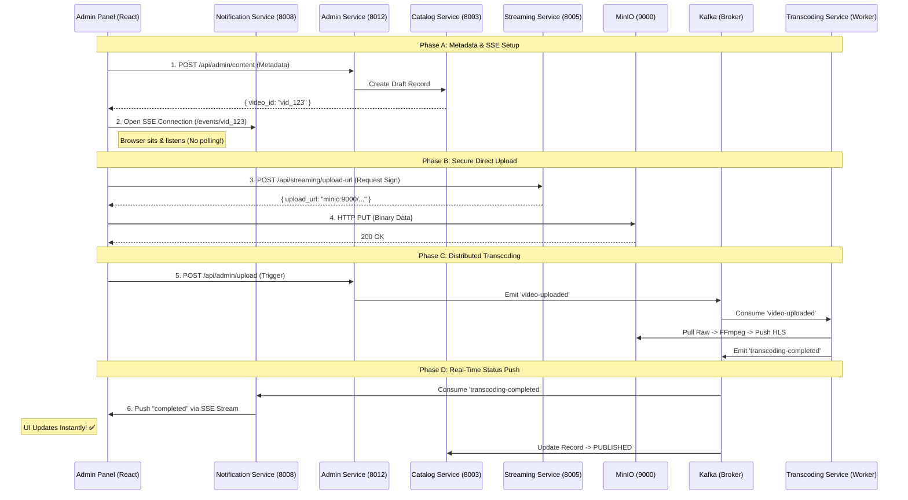

# Video Upload & Processing — How It Works

> **Core Stack**: Go (Admin, Streaming, Notification) · Python/FFmpeg (Transcoding) · MinIO (Storage) · Kafka (Messaging) · MongoDB (Catalog)
> **Modern Pattern**: Direct-to-S3 Uploads · Event-Driven Scaling · **Real-Time Push Status (SSE)** · Adaptive Bitrate Extraction (HLS)

---

## 1. Overview

This architecture handles the end-to-end lifecycle of high-definition video assets—from raw binary upload to multi-bitrate streaming. By decoupling the upload from the processing and the status tracking, the system achieves massive horizontal scalability and zero UI latency.

**Key Architecture Decisions:**

- **Zero-Proxy Binaries**: Massive video files (10GB+) never touch our Go servers; they are PUT directly to MinIO via Presigned URLs.
- **Asynchronous Pipeline**: Processing is event-driven via Kafka, allowing us to scale FFmpeg workers independently.
- **Real-Time Feed**: We use **Server-Sent Events (SSE)** to push status updates from Kafka directly to the browser, eliminating the need for 404-prone polling.

---

## 2. System Architecture Diagram

---

## 3. Process Flow Breakdown

### Phase A: Metadata Registration

We first register the content metadata in the **Catalog Service**. This creates the `VideoID` which acts as the primary key for the entire lifecycle. At this stage, the Admin Panel also opens a persistent **SSE (Server-Sent Event)** connection to the **Notification Service** to listen for future success signals.

---

### Phase B: Secure Direct Upload

The **Streaming Service** generates a temporary, cryptographically signed URL. The browser uses this to upload the file directly to **MinIO**.

- **Benefit**: No bottleneck on the application servers.
- **Security**: The URL expires after 15 minutes and is tied to a specific file path.

---

### Phase C: Distributed Transcoding

Once the upload is confirmed, the **Transcoding Service** (worker) takes over:

1. **Fetch**: Pulls the master file from the `videos/raw/` bucket.
2. **Transform**: Runs FFmpeg to generate an HLS (HTTP Live Streaming) folder containing:
   - Multiple resolutions (1080p, 720p, 480p).
   - `.ts` video segments.
   - `master.m3u8` playlist.
3. **Commit**: Pushes the HLS folder to the `hls/` bucket.

---

### Phase D: Real-Time Status Push

This is where the "Proper Flow" shines.

1. The Transcoder emits a `transcoding-completed` event to **Kafka**.
2. The **Notification Service** (listening to Kafka) identifies the exact browser waiting for this `VideoID`.
3. It **"pushes"** a success signal down the open SSE connection.
4. The Admin UI transitions to "Success" instantly.

---

## 4. Key Technical Decisions

| Feature           | Design                   | Benefit                                                                                     |
| :---------------- | :----------------------- | :------------------------------------------------------------------------------------------ |
| **Asset Storage** | MinIO (S3 Compatible)    | Secure, high-performance binary storage with support for presigned URLs.                    |
| **Orchestration** | Kafka (Event Bus)        | Decouples services; ensures no upload is lost even if a service restarts.                   |
| **UX Logic**      | **Real-Time Push (SSE)** | Eliminates 404 errors from polling. Provides instant UI updates with zero polling overhead. |
| **Packaging**     | HLS (Adaptive Bitrate)   | Ensures smooth playback on mobile (4G) and desktop (Fiber) networks.                        |

---

## 5. Storage Mapping

| Asset Type            | Path In MinIO                         | Description                                         |
| :-------------------- | :------------------------------------ | :-------------------------------------------------- |
| **Raw Master**        | `videos/raw/{id}.mp4`                 | The original high-quality upload (Source of Truth). |
| **Media Assets**      | `videos/raw/{id}_{poster/banner}.jpg` | Static images used for UI browsing.                 |
| **Streamable Assets** | `hls/{id}/master.m3u8`                | The final HLS playlist for production playback.     |

---

                           VIDEO UPLOAD & PROCESSING ARCHITECTURE

┌────────────────────────────────────────────────────────────────────────────────────────────┐
│ FRONTEND LAYER │
│ │
│ ┌──────────────────────────────┐ │
│ │ Admin Panel (React UI) │ │
│ │ Upload + Progress + Success │ │
│ └──────────────┬───────────────┘ │
└───────────────────────────────┬────────┴────────────────────────────────────────────────────┘
│
│ 1. Create Metadata
▼
┌────────────────────────────────────────────────────────────────────────────────────────────┐
│ APPLICATION SERVICES │
│ │
│ ┌──────────────────┐ ┌──────────────────┐ ┌──────────────────┐ │
│ │ Admin Service │────▶│ Catalog Service │────▶│ MongoDB │ │
│ │ (Go : 8012) │ │ (Go : 8003) │ │ Metadata DB │ │
│ └────────┬─────────┘ └──────────────────┘ └──────────────────┘ │
│ │ │
│ │ 2. Trigger Upload │
│ ▼ │
│ ┌──────────────────┐ │
│ │ Streaming Service│ │
│ │ (Go : 8005) │ │
│ └────────┬─────────┘ │
└───────────┼─────────────────────────────────────────────────────────────────────────────────┘
│
│ 3. Presigned URL
▼
┌────────────────────────────────────────────────────────────────────────────────────────────┐
│ STORAGE LAYER │
│ │
│ ┌──────────────────────────────┐ │
│ │ MinIO (S3 Storage) │ │
│ │ raw/, hls/, images/ │ │
│ └──────────────┬───────────────┘ │
└───────────────────────────────┬───┴────────────────────────────────────────────────────────┘
│
│ 4. Upload Complete Event
▼
┌────────────────────────────────────────────────────────────────────────────────────────────┐
│ EVENT DRIVEN LAYER │
│ │
│ ┌──────────────────────────────┐ │
│ │ Kafka Broker │ │
│ │ video-uploaded topic │ │
│ └──────────────┬───────────────┘ │
└───────────────────────────────┬───┴────────────────────────────────────────────────────────┘
│
│ 5. Consume Event
▼
┌────────────────────────────────────────────────────────────────────────────────────────────┐
│ PROCESSING LAYER │
│ │
│ ┌──────────────────────────────────────┐ │
│ │ Transcoding Service (Python + FFmpeg)│ │
│ │ 1080p / 720p / 480p + HLS │ │
│ └────────────────┬─────────────────────┘ │
└────────────────────────────────┼────────────────────────────────────────────────────────────┘
│
│ 6. transcoding-completed
▼
┌────────────────────────────────────────────────────────────────────────────────────────────┐
│ REAL TIME NOTIFICATION │
│ │
│ ┌──────────────────────┐ ┌──────────────────────┐ │
│ │ Notification Service │────────▶│ SSE Push to Browser │ │
│ │ (Go : 8008) │ │ Real-time Success UI │ │
│ └──────────────────────┘ └──────────────────────┘ │
└────────────────────────────────────────────────────────────────────────────────────────────┘
